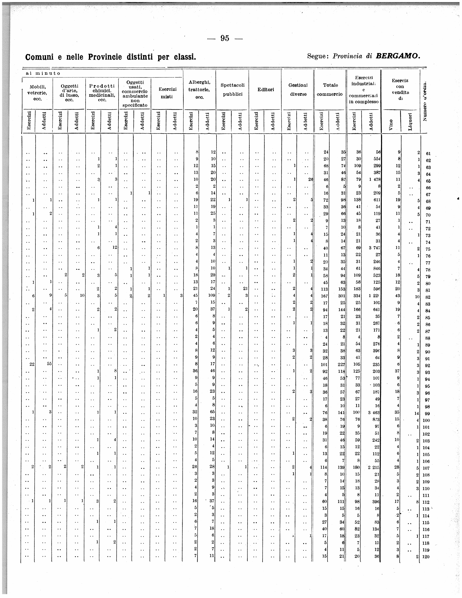
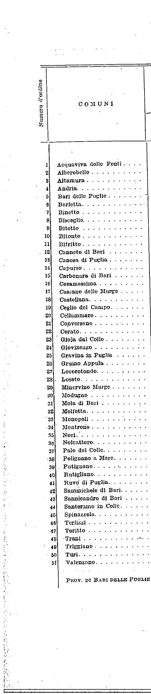
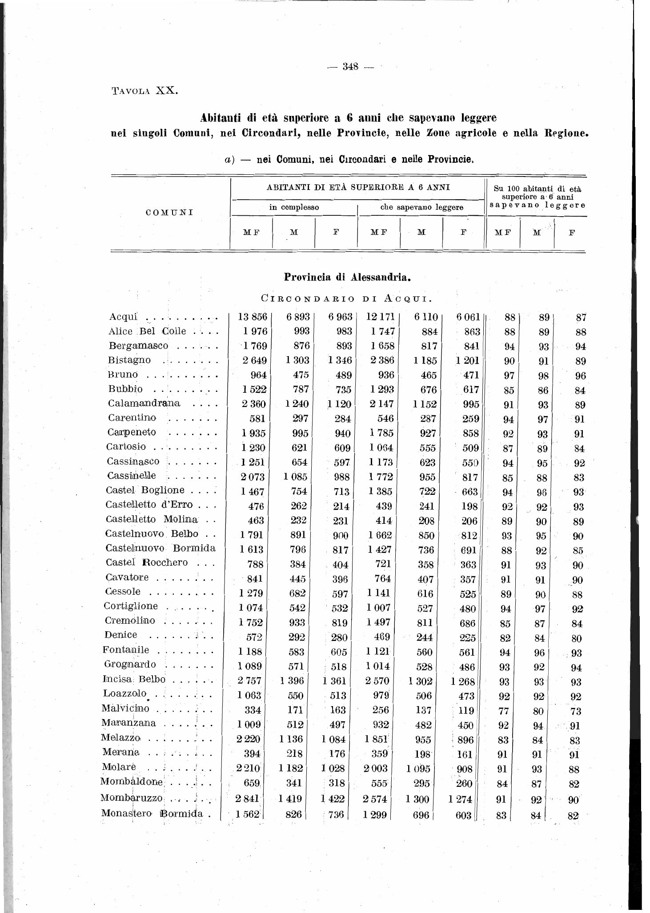

# Agentic Census Data Extraction

**Digitizing Italy's 1927 Industrial Census using AI agents orchestrated by Claude Code**

> 188 scanned PDF pages of a 1927 Italian census transformed into structured JSON through parallel AI agent workers, multimodal vision, cross-validation pipelines, and a historical municipality crosswalk spanning 1921-1954.

---

## The Problem

Italy's 1927 Industrial Census (*Censimento Industriale e Commerciale*) contains municipality-level data on industrial establishments and workers across all Italian provinces. This data exists only in ~190 scanned PDF pages of typewritten tables from nearly 100 years ago. Extracting this data manually would take weeks and be error-prone.

The same challenge applies to the 1921 Population Census (*Censimento della Popolazione*), which covers ~7,800 municipalities across 18 regions in 249 PDF pages.

**Goal:** Build a structured, validated dataset of pre-WWII Italian municipality covariates, linking three historical censuses (1921, 1927, 1929) through a municipality crosswalk that accounts for nearly a century of administrative boundary changes.

---

## What the Source Material Looks Like

The original census volumes are large scanned PDFs -- each containing dozens of pages of typewritten tables. Here is a raw page from the 1927 Industrial Census:

<p align="center">
  
  <br><em>A raw page from the original census volume -- typewritten tables with 5-6 data columns per province</em>
</p>

The first step in our pipeline was to **crop these full-volume PDFs into individual two-page pairs** (one pair per province table), producing files like `pair_0019.pdf`:

<p align="center">
  
  <br><em>A cropped pair (pair_0019.pdf) -- BARI DELLE PUGLIE, extracted and ready for the AI agent</em>
</p>

For the 1921 Population Census, a similar approach was used -- region-level PDFs were extracted from the original volumes:

<p align="center">
  
  <br><em>A page from the 1921 Population Census (TAVOLA XX) -- literacy data by municipality</em>
</p>

> Sample PDFs are included in [`data/`](data/) so you can see the full before-and-after workflow.

---

## From Full Volume to Cropped Pairs: The PDF Pipeline

The original census exists as a single large volume split into ~17 PDF parts (`IST0007118CIC1927Vol1...part001.pdf` through `part017.pdf`). Each part contains multiple province tables spanning consecutive pages.

**The cropping workflow:**

```
 Original Volume (17 parts, ~102 MB total)
          │
          ▼
 ┌──────────────────────────────┐
 │  Manual page-range mapping   │  ← Identify which pages belong to which province
 │  (config.json)               │
 └──────────────┬───────────────┘
                │
                ▼
 ┌──────────────────────────────┐
 │  PyPDF page extraction       │  ← Extract 2-page spreads (left: names, right: data)
 │  → pair_0000.pdf             │
 │  → pair_0001.pdf             │
 │  → ...                       │
 │  → pair_0187.pdf             │
 └──────────────┬───────────────┘
                │
                ▼
        188 individual PDFs
        (~500 KB each, ~93 MB total)
        One pair = one province table
```

**Why pairs?** Each province's data is printed as a two-page spread:
- **Left page**: Municipality names with sequential numbering (N. d'ordine)
- **Right page**: Numerical data columns (establishments, workers, wine/liquor sales)

The AI agent reads both pages together and cross-references the row numbers to align names with data -- exactly as a human researcher would.

For provinces with many municipalities, the table spans multiple pairs (e.g., ALESSANDRIA uses pairs 0001-0006 for 343 municipalities). The `numero_ordine` continues across files, and the agents handle this seamlessly.

---

## Architecture Overview

```
                    ┌─────────────────────────────────┐
                    │      run_extraction.sh           │
                    │   (Parallel Orchestrator)        │
                    └──────────┬──────────────────────┘
                               │
              ┌────────────────┼────────────────┐
              │                │                │
       ┌──────▼──────┐ ┌──────▼──────┐ ┌──────▼──────┐
       │  Worker 1   │ │  Worker 2   │ │  Worker 3   │
       │ claude -p   │ │ claude -p   │ │ claude -p   │
       │  (Agent)    │ │  (Agent)    │ │  (Agent)    │
       └──────┬──────┘ └──────┬──────┘ └──────┬──────┘
              │                │                │
       ┌──────▼──────────────────────────────────┐
       │         Per-Agent Loop:                  │
       │  1. Read PDF    (multimodal vision)      │
       │  2. Extract     (structured JSON)        │
       │  3. Validate    (schema + totals)        │
       │  4. Compare     (cross-check vs CSV)     │
       │  5. Self-correct (fix digit confusions)  │
       └──────┬──────────────────────────────────┘
              │
       ┌──────▼──────────────────────────────────┐
       │    census_extractor.py (CLI Helper)      │
       │  status | next | validate | compare      │
       └──────┬──────────────────────────────────┘
              │
       ┌──────▼──────────────────────────────────┐
       │         Output: pair_XXXX.json           │
       │    190 structured JSON extractions       │
       │    ~7,800 municipalities digitized       │
       └─────────────────────────────────────────┘
```

The system orchestrates multiple Claude Code instances running in parallel, each autonomously:
1. **Reading** a scanned census PDF using multimodal vision
2. **Extracting** structured data following a strict JSON schema
3. **Validating** against schema rules and provincial totals
4. **Cross-checking** against a reference CSV with fuzzy name matching
5. **Self-correcting** systematic digit confusions (0↔9, 0↔6, 2↔3)

---

## Three Pipelines

### Pipeline 1: Industrial Census 1927 (Claude Vision Agents)

The core pipeline. Each of the 188 PDFs shows a two-page spread with a typewritten table:

```
┌──────────┬──────────────────────┬───────────┬───────────┬───────────┬───────────┬───────────┐
│ N.       │ COMUNI               │ Complesso │ Complesso │ Commercio │ Commercio │ Vendita   │
│ d'ordine │                      │ Esercizi  │ Addetti   │ Esercizi  │ Addetti   │ Vino      │
├──────────┼──────────────────────┼───────────┼───────────┼───────────┼───────────┼───────────┤
│ 1        │ Acquaviva delle Fonti│ 344       │ 726       │ ..        │ 220       │ 3         │
│ 2        │ Alberobello          │ 260       │ 556       │ ..        │ 183       │ 10        │
│ ...      │ ...                  │ ...       │ ...       │ ...       │ ...       │ ...       │
├──────────┼──────────────────────┼───────────┼───────────┼───────────┼───────────┼───────────┤
│          │ Totale Provincia     │ 25610     │ 71523     │ ..        │ 24180     │ 1197      │
└──────────┴──────────────────────┴───────────┴───────────┴───────────┴───────────┴───────────┘
```

**Key innovation:** Claude Code's native multimodal vision reads the scanned PDFs directly -- no traditional OCR preprocessing needed. The agent sees the full page image, interprets the 1927 typeface, and outputs structured JSON. This was dramatically more accurate than traditional OCR pipelines.

**Extraction output (JSON):**
```json
{
  "provincia": "BARI DELLE PUGLIE",
  "comuni": [
    {
      "numero_ordine": 1,
      "comune": "Acquaviva delle Fonti",
      "complesso_esercizi": 344,
      "complesso_addetti": 726,
      "commercio_esercizi": null,
      "commercio_addetti": 220,
      "vendita_vino": 3,
      "vendita_liquori": 1
    }
  ],
  "totale_provincia": {
    "complesso_esercizi": 25610,
    "complesso_addetti": 71523,
    "commercio_esercizi": null,
    "commercio_addetti": 24180,
    "vendita_vino": 1197,
    "vendita_liquori": 509
  }
}
```

### End-to-End Example: BARI DELLE PUGLIE

All sample files for this province are included in the repo so you can follow the complete pipeline:

| Stage | File | What it contains |
|-------|------|-----------------|
| **1. Source PDF** | [`data/cropped_pairs/pair_0019.pdf`](data/cropped_pairs/pair_0019.pdf) | The scanned two-page spread (shown in screenshot above) |
| **2. Agent output** | [`examples/sample_extraction.json`](examples/sample_extraction.json) | Structured JSON extracted by Claude's vision |
| **3. Final dataset** | [`examples/bari_covariates.csv`](examples/bari_covariates.csv) | The 47 BARI municipalities in the master CSV |

Notice how names evolve across the pipeline:
- Census (1927): *"Bari delle Puglie"* → CSV (1950): **BARI**
- Census (1927): *"Gioja dal Collo"* → CSV (1950): **GIOIA DEL COLLE**
- Census (1927): *"Cellammare"* → CSV (1950): **CELLAMARE**

The fuzzy matching engine in `extract_ind_workers.py` handles these automatically, and the `ind_workers_1927` column in the CSV was populated from `complesso_addetti` in the JSON. For BARI, **100% of the 44 comparable values matched exactly** -- the agent read the 1927 typeface perfectly.

### Pipeline 2: Population Census 1921 (Mistral OCR + Crosswalk)

Before settling on Claude's vision, we built a separate pipeline using **Mistral's OCR API** for the 1921 population census:

```
 PDF (18 regions, 249 pages)
          │
          ▼
 ┌─────────────────────┐
 │   Mistral OCR API   │  ← $0.002/page, cached to avoid re-processing
 │  (mistral-ocr-latest)│
 └─────────┬───────────┘
           │  Raw markdown
           ▼
 ┌─────────────────────┐
 │  parse_and_match.py │  ← Extract TAVOLA XX tables, compute analfabeti
 └─────────┬───────────┘
           │
           ▼
 ┌─────────────────────┐
 │ crosswalk_match.py  │  ← Fuzzy match to 1950 municipality codes
 └─────────┬───────────┘
           │
           ▼
 ┌─────────────────────┐
 │ validate_values.py  │  ← Human visual confirmation against PDF pages
 └─────────┬───────────┘
           │
           ▼
  fill_missing_1921.csv   (1,828 rows, 94.2% accuracy)
  Coverage: 73.5% → 97.0%
```

**Mistral OCR** excelled at converting the population census pages to structured markdown. The pipeline then parsed the literacy tables (TAVOLA XX), computed derived fields (`popres_1921_tot = M + F`, `analfabeti = (M+F) - MF_literate`), and fuzzy-matched municipality names against a modern crosswalk.

**Why two approaches?** The industrial census (Pipeline 1) has complex multi-column tables with digit-level precision requirements. Claude's vision handled this natively with remarkable accuracy. The population census (Pipeline 2) has simpler, more regular table structures that Mistral OCR could process efficiently at very low cost (~$0.50 for all 249 pages). We used the best tool for each job.

### Pipeline 3: Municipality Crosswalk (1921-1954)

Italian municipalities have undergone thousands of boundary changes since 1921. To build a consistent panel dataset, we constructed a crosswalk mapping ~7,800 modern (1950) municipalities backward to their historical equivalents:

```
 ANPR (national registry)  +  SISTAT (historical events)
          │                           │
          ▼                           ▼
 ┌──────────────────────────────────────────┐
 │          build_crosswalk.py              │
 │  - Extract "alive sets" for each year    │
 │  - Trace extinctions/creations/mergers   │
 │  - Classify: DIRECT vs AGGREGATE         │
 │  - Flag territory transfers              │
 └──────────────────┬───────────────────────┘
                    │
                    ▼
         crosswalk_1921_1954.csv
         7,803 municipalities mapped
         7,611 usable (97.5%)
         6,943 traceable across all 3 censuses
```

---

## Parallel Agent Orchestration

The heart of the system is `run_extraction.sh`, which launches multiple Claude Code agents in parallel:

```bash
./opus46/run_extraction.sh --workers 3 --limit 20
```

### How It Works

**1. Atomic claiming** -- Each worker atomically claims a PDF using `noclobber` lock files, preventing race conditions:

```bash
if ! (set -o noclobber; echo "$$" > "$lock_file") 2>/dev/null; then
    sleep 0.5   # Another worker got it
    continue
fi
```

**2. Agent invocation** -- Each worker spawns a fresh Claude Code session with a structured prompt:

```bash
claude -p "$prompt" \
    --max-turns 25 \
    --allowedTools "Read Write Edit Bash Glob Grep"
```

**3. Self-correction loop** -- Each agent validates its own output and fixes errors before moving on:

```
Extract → Validate → Compare → Fix → Re-validate → Done
```

**4. Rate limit handling** -- Workers gracefully stop when API limits are hit:

```bash
if echo "$output" | grep -qiE "rate limit|quota exceeded"; then
    rm -f "$lock_file"
    break  # Stop cleanly
fi
```

**5. Progress tracking** -- Filesystem-based (no database needed). A PDF is "done" when `pair_XXXX.json` exists:

```bash
python3 opus46/census_extractor.py status

==================================================
  OPUS46 EXTRACTION STATUS
==================================================
  Total PDFs:     188
  Completed:      190
  Skipped:          2
  Remaining:        0
  Next:           ALL DONE!
==================================================
```

---

## Validation & Quality

### Multi-Layer Validation

Each extraction goes through several validation steps:

| Step | What it checks | Tool |
|------|---------------|------|
| **Schema** | Required fields, correct types, no strings where ints expected | `census_extractor.py validate` |
| **Totals** | Sum of municipality values matches provincial total row | `census_extractor.py validate` |
| **Sequential** | `numero_ordine` increments 1, 2, 3... without gaps | `census_extractor.py validate` |
| **Cross-reference** | Extracted values match reference CSV (fuzzy name matching) | `census_extractor.py compare` |
| **Sanity** | `complesso_addetti >= commercio_addetti` (workers is a superset) | CLAUDE.md rules |

### Digit Confusion Handling

The 1927 typeface causes systematic misreadings:

| Confusion | Frequency | Example |
|-----------|-----------|---------|
| **0 ↔ 9** | Most common | "70" read as "79" |
| **0 ↔ 6** | Frequent | "108" read as "168" |
| **2 ↔ 3** | Occasional | "2305" read as "3365" |

The `compare` step cross-validates against a reference CSV and flags these. Agents are instructed to trust the CSV value when the difference matches a known digit confusion pattern.

### Accuracy Benchmarks

| Province | Accuracy | Notes |
|----------|----------|-------|
| AREZZO | **100%** | Perfect extraction |
| BARI | **100%** (44/44) | All municipalities matched |
| BENEVENTO | **100%** (26/26) | |
| BOLOGNA | **100%** (56/56) | |
| ANCONA | **97.8%** | After digit corrections |
| BELLUNO | **98.4%** (60/61) | |
| BERGAMO | **~97%** | After fuzzy match filtering |

---

## CLAUDE.md: Instructing the Agents

Each agent receives instructions through `CLAUDE.md`, which defines:

1. **The census page layout** -- A visual diagram of the 5-6 column table structure
2. **The JSON schema** -- Exact field names, types, and nullable rules
3. **Step-by-step workflow** -- Read → Extract → Write → Validate → Compare
4. **Edge cases** -- `.." = null`, space thousands separators, continuation pages, noise columns
5. **Quality checks** -- Totals must match sums, sequential ordering, addetti superset rule

This file acts as the "training manual" for each autonomous agent. The agents follow it without human intervention in most cases.

### Edge Case: Noise Column Detection

On some right-side pages, scanning artifacts cause numbers from the facing page to bleed through as a ghost column on the far left:

```
Detection: The column gets progressively truncated toward the bottom
           (3-digit values at top → 2-digit → 1-digit at bottom)

Action: Exclude the entire column, set the field to null.
```

The agents learned to detect this pattern and handle it autonomously.

---

## Repository Structure

```
.
├── README.md
├── LICENSE
│
├── data/                                # Sample PDFs (before & after cropping)
│   ├── original_pdf/                   # Raw census volume parts (~3.6 MB each)
│   │   ├── IST0007118...part001.pdf   # Original multi-page volume part
│   │   └── IST0007118...part003.pdf
│   ├── cropped_pairs/                  # Individual province pairs (~500 KB each)
│   │   ├── pair_0001.pdf              # AGRIGENTO
│   │   ├── pair_0015.pdf              # AREZZO (100% accuracy)
│   │   ├── pair_0019.pdf              # BARI (100% accuracy)
│   │   ├── pair_0028.pdf              # BOLOGNA (100% accuracy)
│   │   └── pair_0060.pdf              # CREMONA
│   └── popolazione_1921/              # Population census samples
│       ├── Piemonte_popolazione_extracted.pdf
│       └── Toscana_popolazione_extracted.pdf
│
├── images/                             # Screenshots for this README
│   ├── original_full_page.png         # Raw census page
│   ├── cropped_pair_example.png       # Cropped pair (BARI)
│   └── popolazione_1921_example.png   # Population census page
│
├── scripts/                            # All pipeline scripts
│   ├── run_extraction.sh              # Parallel agent orchestrator (bash)
│   ├── census_extractor.py            # CLI: status, next, validate, compare
│   ├── main.py                        # Pipeline orchestrator
│   ├── llm_structure.py               # Claude vision integration
│   ├── build_crosswalk.py             # 1921-1954 municipality crosswalk
│   ├── extract_ind_workers.py         # Field detection & CSV matching
│   ├── run_ocr.py                     # Mistral OCR API
│   ├── parse_and_match.py             # Parse OCR markdown → structured data
│   └── validate_values.py             # Visual validation CLI
│
└── examples/                           # Sample outputs & agent instructions
    ├── CLAUDE.md                      # The instruction file agents receive
    ├── sample_extraction.json         # Example output (BARI DELLE PUGLIE)
    └── skip_marker.json               # How non-extractable PDFs are handled
```

---

## Key Technical Decisions

### Why Claude Vision over Traditional OCR?

We tried multiple approaches:

| Approach | Accuracy | Cost | Notes |
|----------|----------|------|-------|
| **Surya OCR** | ~70-80% | Free | Open-source, struggled with 1927 typeface |
| **Transkribus** | ~85% | Paid | Better on handwriting, overkill for typewritten |
| **Mistral OCR** | ~94% | $0.002/page | Excellent for regular tables (used for 1921 pop) |
| **Claude Vision** | **97-100%** | ~$0.05/page | Direct multimodal reading, best for complex tables |

Claude's vision was dramatically better for the industrial census because:
- It understands **context** (column headers, provincial structure, continuation pages)
- It handles **edge cases** natively (noise columns, cropped margins, digit ambiguity)
- It can **self-correct** by cross-referencing with the validation CSV
- No preprocessing or image cleaning needed

### Why Filesystem-Based Progress Tracking?

No database, no state server. Just files:
- `pair_XXXX.json` exists → extraction complete
- `pair_XXXX.lock` exists → worker in progress
- Simple, crash-resistant, works across restarts

### Why Parallel Workers Instead of Batch?

Each PDF requires 10-25 agent turns (read, extract, validate, fix, re-validate). Running sequentially would take days. With 3 parallel workers, the entire corpus was processed in hours.

---

## The Dataset

The final output is a panel dataset at the 1950 municipality level:

| Column | Description | Coverage |
|--------|-------------|----------|
| `comune_matchable_50` | Municipality name (1950) | 100% |
| `region` | Region | 100% |
| `province` | Province | 100% |
| `popres_1921_tot` | Total population 1921 | **97.0%** |
| `popres_1921_f` | Female population 1921 | 72.8% |
| `analfabeti_1921` | Illiterate count 1921 | 67.5% |
| `ind_workers_1927` | Industrial workers 1927 | **68.1%** |
| `agri_workers_1929` | Agricultural workers 1929 | 31.1% |

**7,770 municipalities** across all Italian provinces, linked through a crosswalk that tracks nearly a century of administrative boundary changes (mergers, splits, territory transfers, name changes).

---

## Lessons Learned

1. **Multimodal AI is production-ready for historical document extraction** -- Claude's vision consistently outperformed traditional OCR pipelines on complex historical tables.

2. **Agent self-correction is essential** -- The validate→compare→fix loop caught hundreds of errors that would have been missed in a single-pass extraction.

3. **Cross-validation is cheap and powerful** -- Having a reference CSV (even partially filled) dramatically improved accuracy by catching systematic digit confusions.

4. **Parallel agents need careful coordination** -- Atomic lock files and rate limit detection prevented both race conditions and wasted API calls.

5. **CLAUDE.md as agent training** -- A well-structured instruction file (with visual diagrams, edge cases, and quality checks) is the most effective way to get consistent behavior from autonomous agents.

6. **Cumulative learning via notes.md** -- Each agent session appended learnings about province-specific quirks. Later agents benefited from earlier discoveries.

---

## Tools & Technologies

- **[Claude Code](https://docs.anthropic.com/en/docs/claude-code)** -- CLI agent orchestration with multimodal vision
- **[Mistral OCR](https://docs.mistral.ai/capabilities/document/)** -- Document OCR API for population census
- **Python** -- Data processing, crosswalk building, validation
- **Bash** -- Parallel worker orchestration with atomic locking

---

## Author

Built by [Alessandro Caforio](https://github.com/AlessandroCaforio) as part of a research project on pre-WWII Italian economic history.

The entire extraction workflow -- from raw scanned PDFs to validated structured dataset -- was developed collaboratively with Claude Code (Anthropic's AI coding agent).
